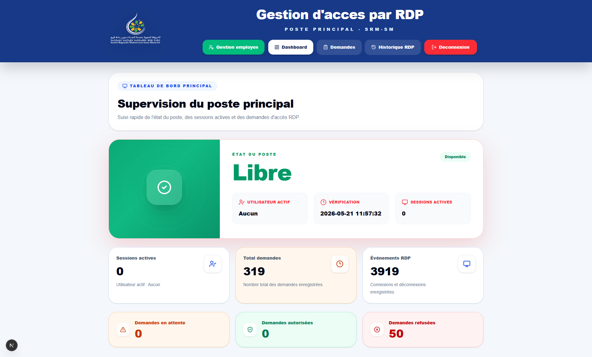
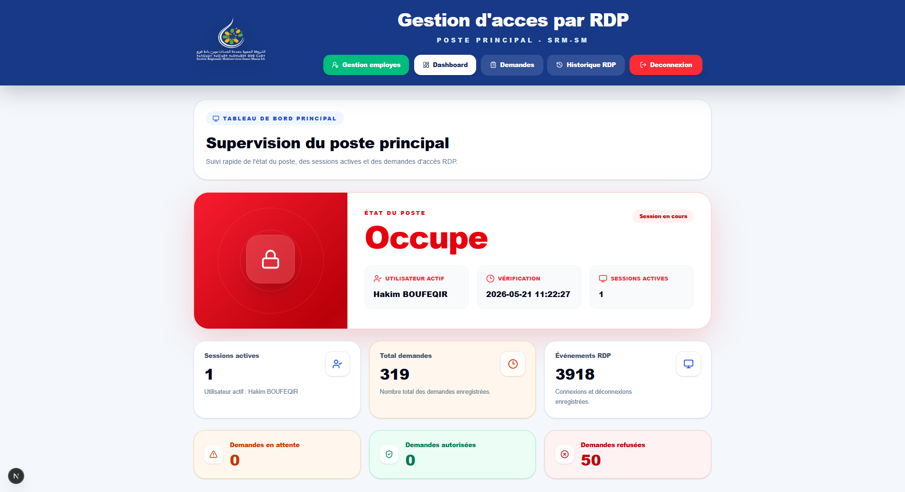
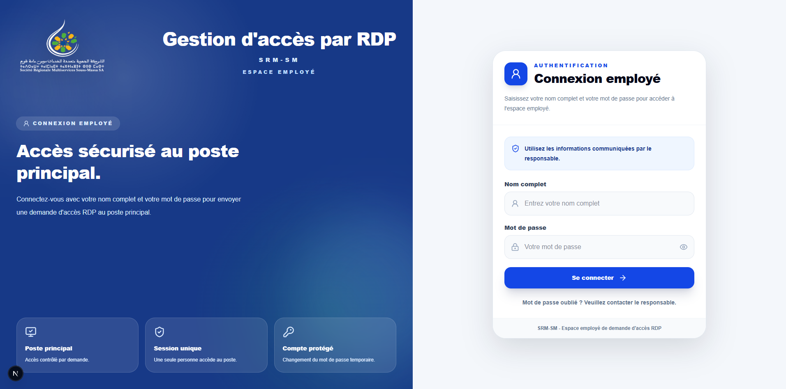
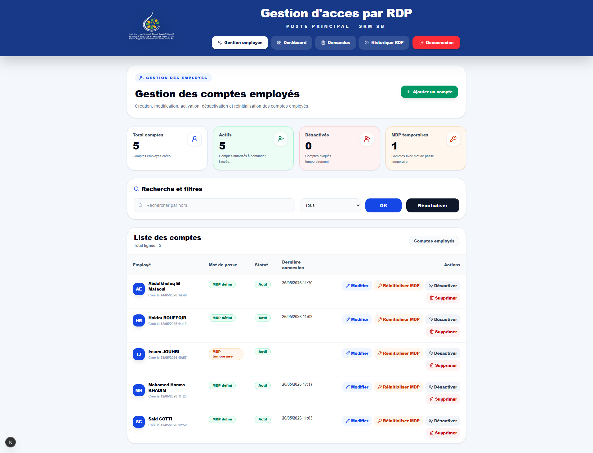
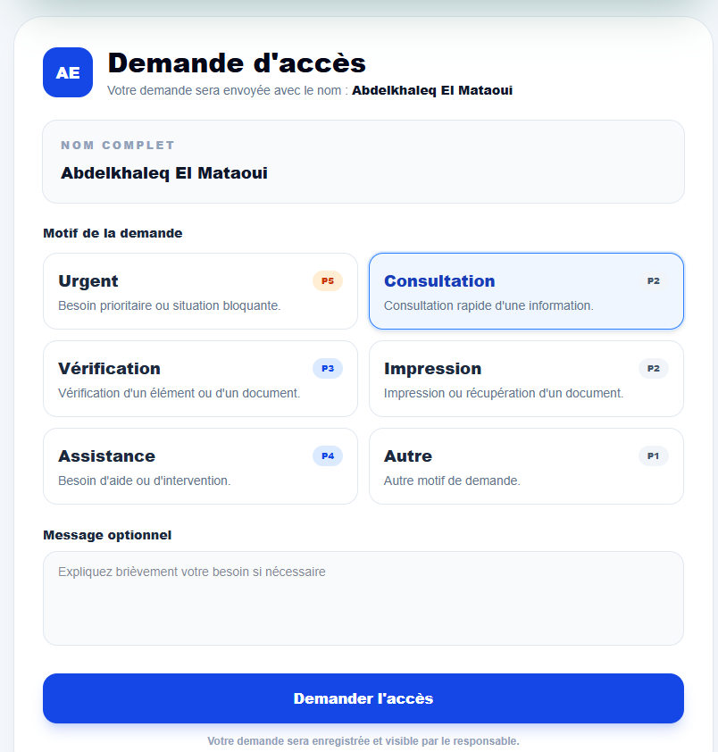
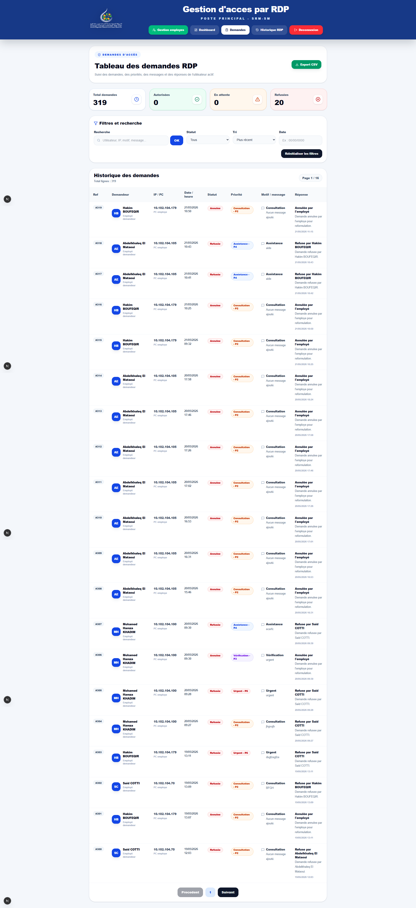
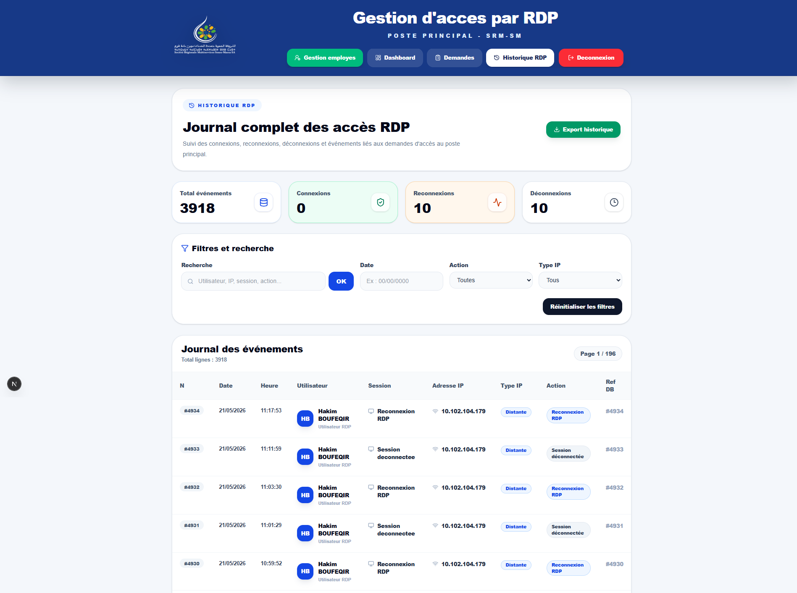
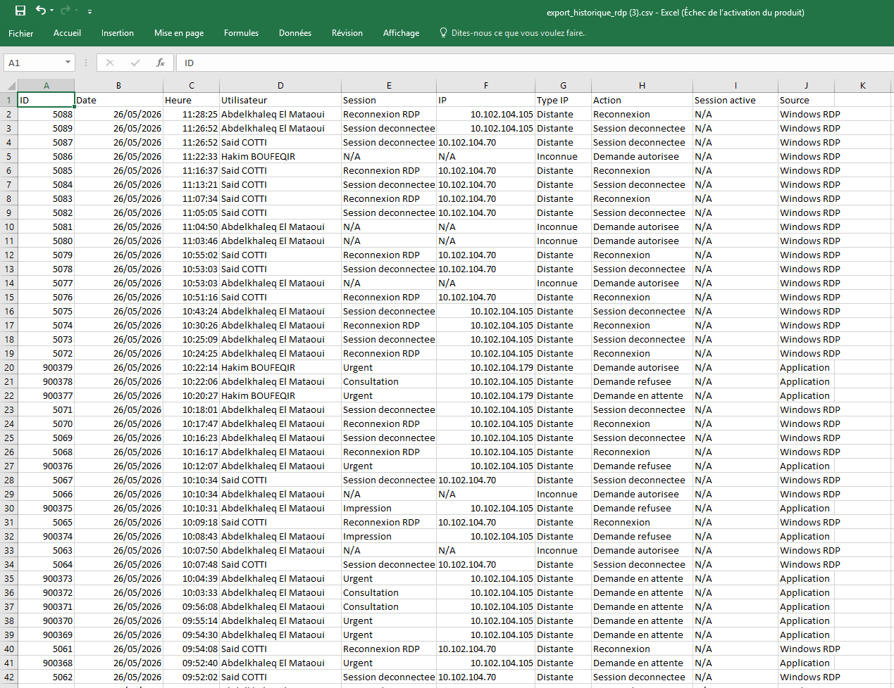
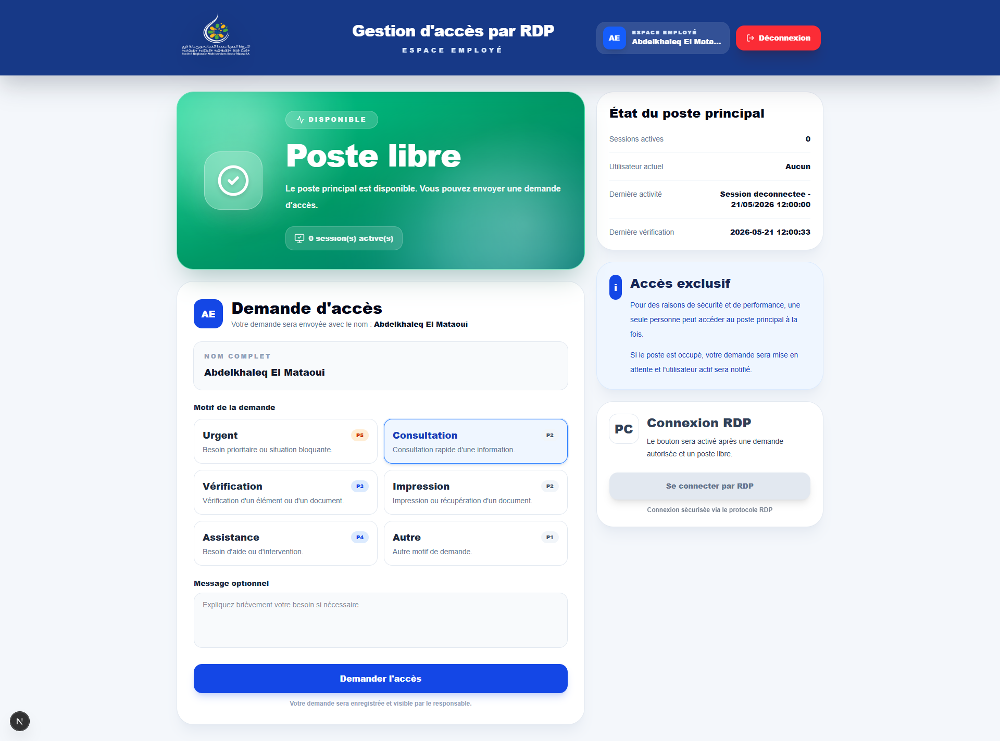
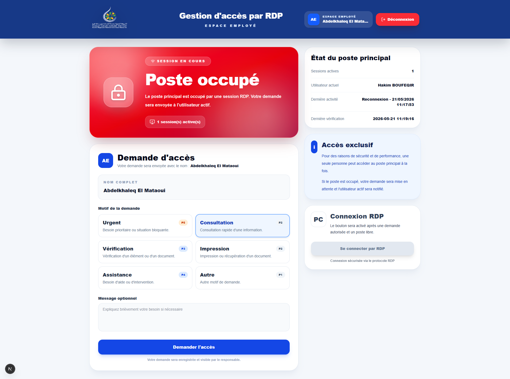

<div align="center">

# 🚀 RDP Access Management System

### Web application for managing and monitoring Remote Desktop (RDP) access


Developed during my Software Engineering Internship at **SRM Souss Massa**.

</div>

---

# 📖 Overview

This project is a web application developed to manage and monitor Remote Desktop (RDP) access inside an enterprise environment.

Instead of allowing employees to connect directly to the workstation, they submit an access request through the application. The responsible person reviews requests, monitors the workstation status in real time, and manages the access queue.

The application also records connection history and provides monitoring tools for administrators.

---

# 🎯 Objectives

- Control access to the main workstation
- Avoid simultaneous RDP connections
- Monitor workstation availability in real time
- Send access requests
- Notify the active user
- Track RDP sessions
- Store connection history
- Export data as CSV

---

# ✨ Main Features

## Employee Space

- Login
- Submit access request
- Select priority
- Write request reason
- Track request status

---

## Responsible Dashboard

- Dashboard
- Access requests
- Accept / Reject requests
- Live workstation status
- Session monitoring
- RDP history
- CSV Export

---

# 🏗 System Architecture

```
Employees
      │
      ▼
Next.js Web Application
      │
      ▼
API Routes
      │
      ▼
SQLite Database
      │
      ▼
PowerShell Scripts
      │
      ▼
Windows RDP Workstation
```

---

# 🛠 Tech Stack

| Technology | Usage |
|------------|----------------|
| Next.js | Frontend Framework |
| React | UI |
| TypeScript | Development |
| Tailwind CSS | Styling |
| SQLite | Database |
| PowerShell | Windows Automation |
| Windows Task Scheduler | Background Tasks |

---

# 📂 Project Structure

```
app/
components/
lib/
public/
scripts_RDP/
types/
README.md
```

---

# ⚡ Installation

```bash
git clone https://github.com/Abdelkhaleq10/app-gestion-rdp.git

cd app-gestion-rdp

npm install

npm run dev
```

---

# 📸 Screenshots

## Dashboard





---

## Employee Interface







---

## Requests Management



---

## RDP History





---

## System Status





# 🚀 Future Improvements

- Email Notifications
- Microsoft Teams Notifications
- Active Directory Integration
- Multi-Workstation Support
- Analytics Dashboard
- Mobile Responsive Version

---

# 👨‍💻 Author

**Abdelkhaleq El Mataoui**

Master Student in Software Engineering & Cybersecurity (ILCS)

📍 Agadir, Morocco

📧 elmataouiabdelkhaleq@gmail.com

🔗 LinkedIn

https://linkedin.com/in/abdelkhaleq-el-mataoui-a8b1463a9

---

⭐ If you like this project, consider giving it a Star.
